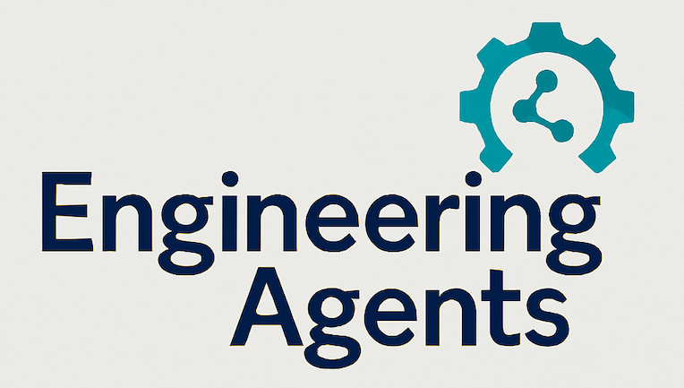

# Welcome to Engineering Agents: The Code

This will be the best location to explore the code behind the different articles and resources on the ["Engineering Agents"](https://engineeringagents.substack.com/) blog.

## Examples

Currently this repo contains the following examples:

1) [Developing a custom logging personality for Embabel](./embabel-examples/customLoggingPersonality/)
2) [Exploring Server Sent Events (SSE)](./embabel-examples/serverSentEvents/)
